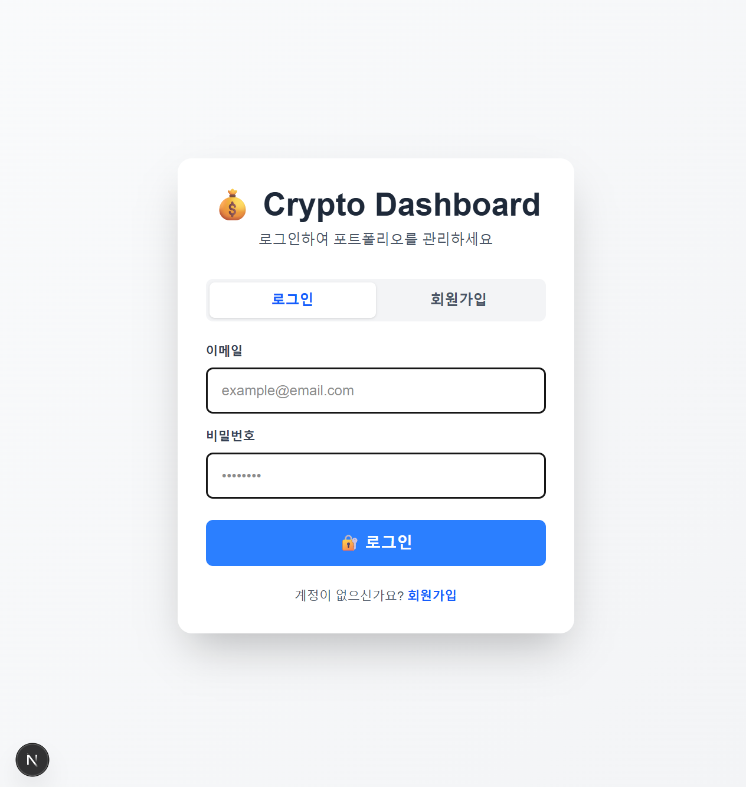
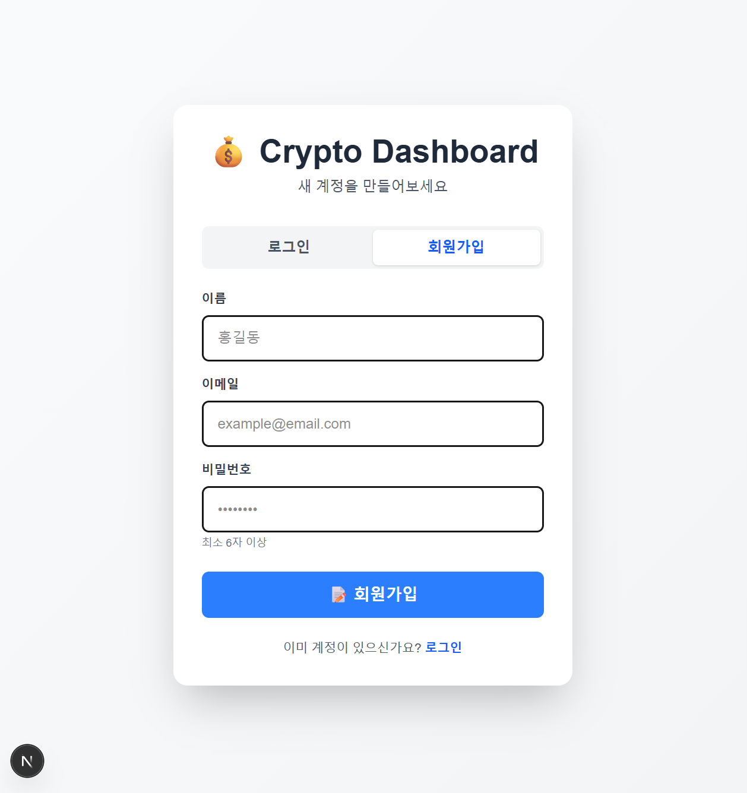
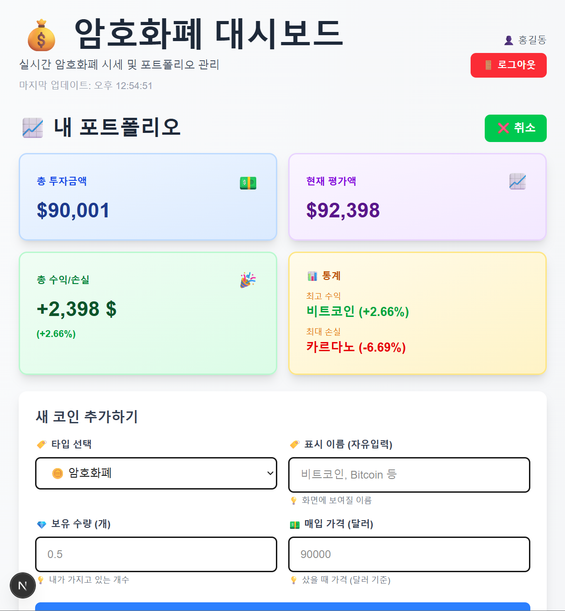
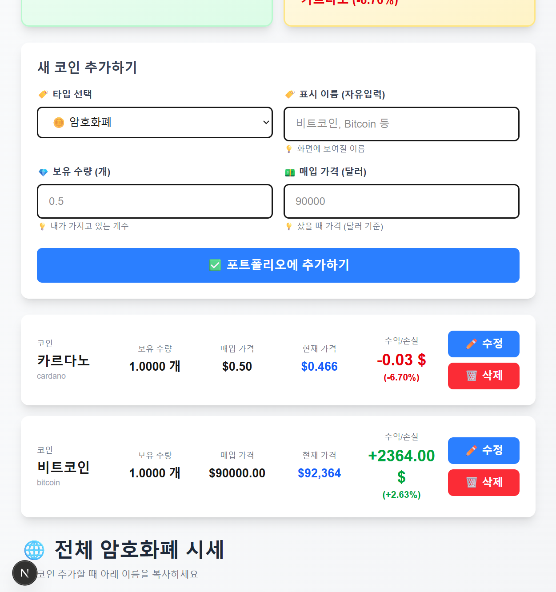
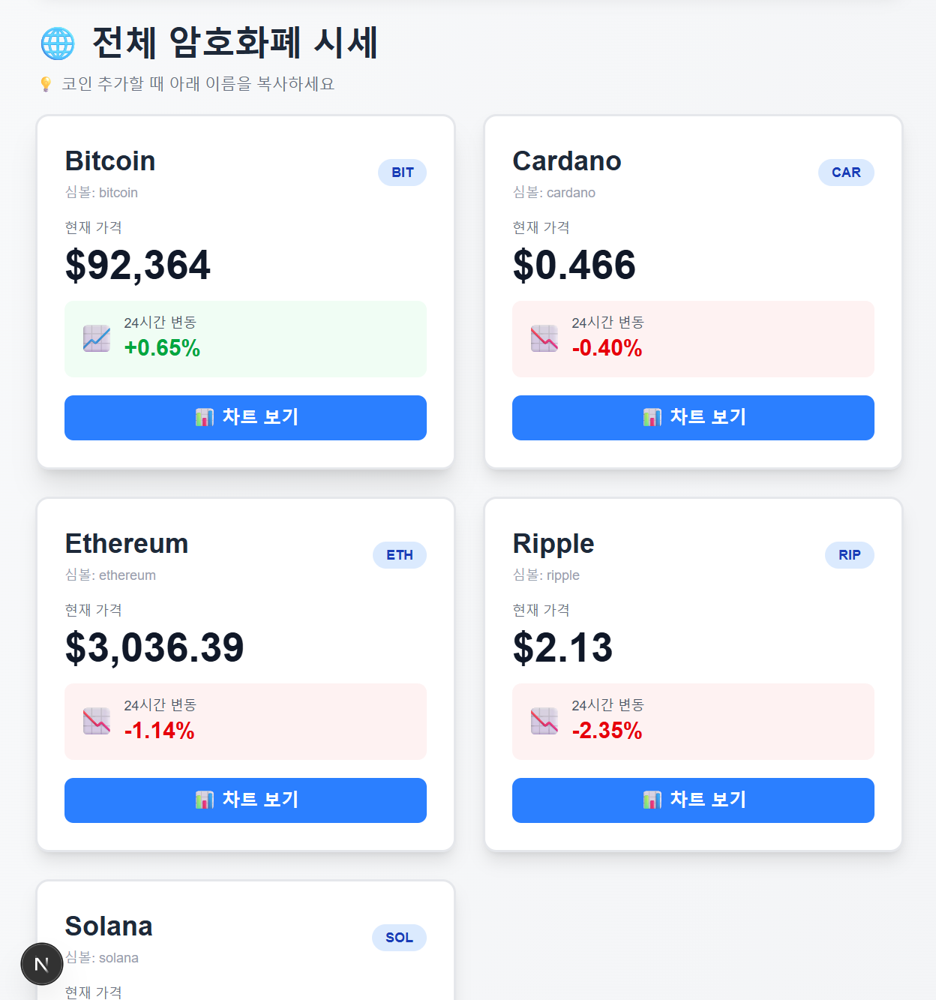
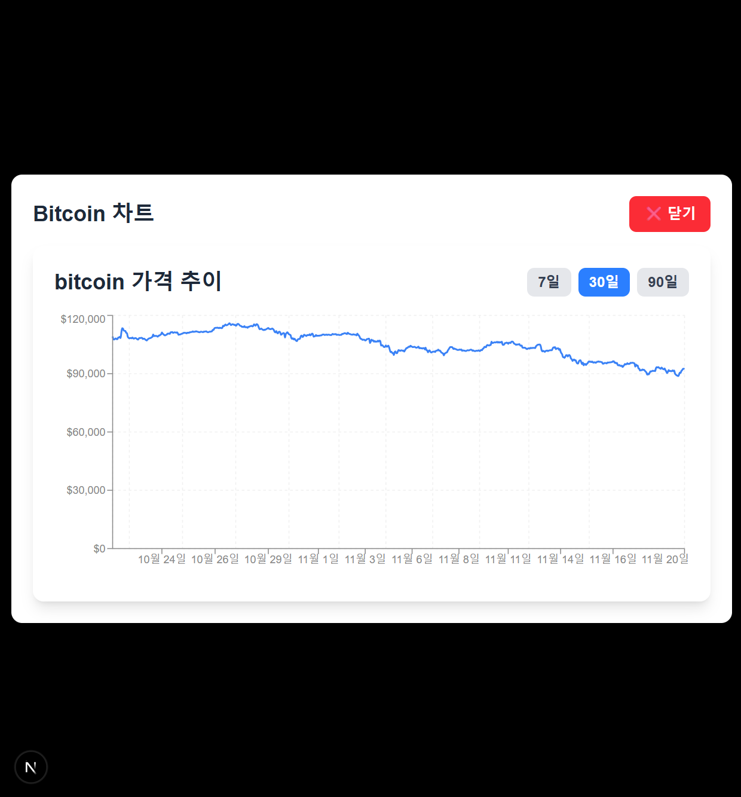
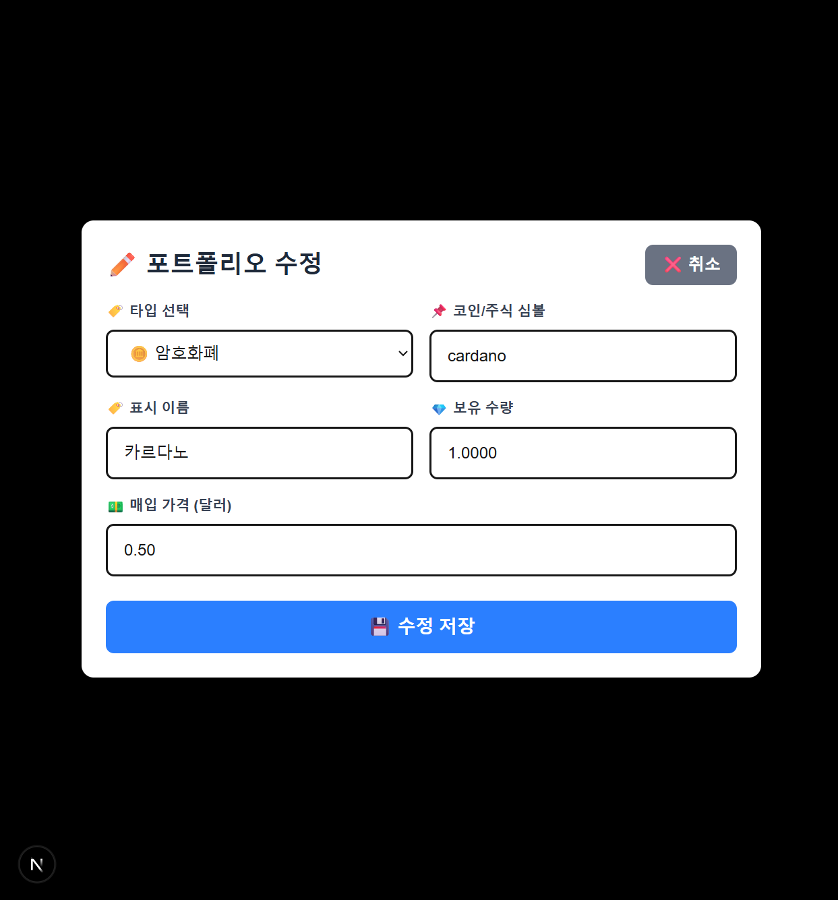

# 💰 Crypto & Stock Portfolio Dashboard

실시간 암호화폐와 미국 주식 시세를 확인하고 포트폴리오를 통합 관리할 수 있는 풀스택 웹 애플리케이션입니다.

**[라이브 데모]** | **[GitHub 리포지토리]** | **[블로그 포스트]**

---

## 🎯 프로젝트 개요

이 프로젝트는 **Next.js 14**, **MySQL**, **JWT 인증**을 활용하여 개발한 풀스택 포트폴리오 관리 시스템입니다. 
암호화폐와 주식을 한 곳에서 관리하고, 실시간 시세 변동을 추적하며, 수익/손실을 자동으로 계산합니다.

---

## ✨ 주요 기능

### 📊 실시간 시세 조회
- **암호화폐**: Bitcoin, Ethereum, Cardano, Solana, Ripple (CoinGecko API)
- **미국 주식**: AAPL, GOOGL, MSFT, TSLA, AMZN (Alpha Vantage API)
- 30초마다 자동 업데이트
- 24시간 변동률 표시

### 💼 포트폴리오 관리 (완전한 CRUD)
- ✅ **Create**: 암호화폐/주식 추가
- ✅ **Read**: 포트폴리오 목록 조회
- ✅ **Update**: 보유 수량/매입 가격 수정
- ✅ **Delete**: 항목 삭제

### 📈 차트 시각화
- 가격 추이 라인 차트 (Recharts)
- 기간 선택: 7일 / 30일 / 90일
- 인터랙티브 차트 (마우스 호버 시 정보 표시)
- 모달 팝업으로 상세 보기

### 💰 포트폴리오 요약 대시보드
- 총 투자금액
- 현재 평가액
- 총 수익/손실 (금액 + %)
- 최고 수익 코인 / 최대 손실 코인

### 🔐 JWT 인증 시스템
- 회원가입 (이메일, 이름, 비밀번호)
- 비밀번호 해싱 (bcrypt)
- JWT 토큰 발급 (7일 유효)
- 로그인/로그아웃
- 토큰 검증 미들웨어

### 🎨 UI/UX
- 반응형 디자인 (Mobile / Tablet / Desktop)
- Tailwind CSS로 세련된 디자인
- 그래디언트 배경
- 부드러운 애니메이션 및 트랜지션
- 사용자 이름 표시

---

## 🛠️ 기술 스택

### **Frontend**
- **Framework**: Next.js 14 (App Router)
- **Language**: TypeScript
- **Styling**: Tailwind CSS
- **Chart**: Recharts
- **State Management**: React Hooks (useState, useEffect)

### **Backend**
- **Runtime**: Node.js
- **Framework**: Next.js API Routes
- **Authentication**: JWT + bcryptjs
- **API Integration**: CoinGecko API, Alpha Vantage API

### **Database**
- **DBMS**: MySQL 8.0
- **Connection**: mysql2/promise
- **ORM**: Raw SQL queries

### **Tools & Libraries**
- **Package Manager**: npm
- **Version Control**: Git
- **Environment**: Node.js 18+

---

## 📦 설치 및 실행

### **사전 요구사항**
- Node.js 18+ 설치
- MySQL 8.0 설치
- npm 또는 yarn

### **1단계: 저장소 클론**
git clone https://github.com/yourusername/crypto-dashboard.git
cd crypto-dashboard

### **2단계: 패키지 설치**
npm install

### **3단계: 데이터베이스 설정**
MySQL에서 실행:
CREATE DATABASE crypto_dashboard;
USE crypto_dashboard;

-- Users 테이블
CREATE TABLE users (
id INT PRIMARY KEY AUTO_INCREMENT,
email VARCHAR(100) UNIQUE NOT NULL,
name VARCHAR(100),
password VARCHAR(255),
created_at TIMESTAMP DEFAULT CURRENT_TIMESTAMP
);

-- Portfolio 테이블
CREATE TABLE portfolios (
id INT PRIMARY KEY AUTO_INCREMENT,
user_id INT,
symbol VARCHAR(20) NOT NULL,
coin_name VARCHAR(100),
type VARCHAR(20) DEFAULT 'crypto',
quantity DECIMAL(20, 8) DEFAULT 0,
purchase_price DECIMAL(20, 2),
added_at TIMESTAMP DEFAULT CURRENT_TIMESTAMP,
FOREIGN KEY (user_id) REFERENCES users(id)
);

### **4단계: 환경 변수 설정**
프로젝트 루트에 `.env.local` 파일 생성:
Database
DB_HOST=localhost
DB_USER=root
DB_PASSWORD=your_password
DB_NAME=crypto_dashboard
DB_PORT=3306

APIs
ALPHA_VANTAGE_API_KEY=your_alpha_vantage_key

JWT
JWT_SECRET=your_random_jwt_secret_key_here

**JWT 비밀 키 생성:**
node -e "console.log(require('crypto').randomBytes(32).toString('hex'))"

### **5단계: 서버 실행**
npm run dev

브라우저에서 `http://localhost:3001` 접속

---

## 🔑 API 키 발급

### **CoinGecko API** (무료)
- 별도 설정 없음 (무료 사용 가능)
- 선택사항: [CoinGecko](https://www.coingecko.com/en/developers/dashboard)에서 API 키 발급

### **Alpha Vantage API**
1. [Alpha Vantage](https://www.alphavantage.co/support/#api-key) 접속
2. 이메일 입력 후 "GET FREE API KEY" 클릭
3. 받은 API 키를 `.env.local`의 `ALPHA_VANTAGE_API_KEY`에 입력

---

## 📁 프로젝트 구조
crypto-dashboard/          
├── app/          
│ ├── api/          
│ │ ├── auth/          
│ │ │ ├── login/route.js          
│ │ │ └── register/route.js          
│ │ ├── crypto/          
│ │ │ ├── price/route.js          
│ │ │ └── chart/route.js          
│ │ ├── stock/          
│ │ │ ├── price/route.js          
│ │ │ └── chart/route.js          
│ │ └── portfolio/route.js          
│ ├── login/          
│ │ └── page.tsx          
│ ├── page.tsx          
│ └── layout.tsx          
├── components/          
│ └── CryptoChart.tsx          
├── lib/          
│ ├── db.js          
│ └── jwt.js          
├── .env.local          
├── .gitignore          
├── package.json          
├── tsconfig.json          
└── README.md          
          

---

## 🚀 주요 엔드포인트

### **인증 API**
- `POST /api/auth/register` - 회원가입
- `POST /api/auth/login` - 로그인

### **포트폴리오 API**
- `GET /api/portfolio?userId=1` - 포트폴리오 조회
- `POST /api/portfolio` - 항목 추가
- `PUT /api/portfolio` - 항목 수정
- `DELETE /api/portfolio?id=1` - 항목 삭제

### **시세 API**
- `GET /api/crypto/price?ids=bitcoin,ethereum` - 암호화폐 가격
- `GET /api/crypto/chart?id=bitcoin&days=7` - 암호화폐 차트
- `GET /api/stock/price?symbols=AAPL,GOOGL` - 주식 가격
- `GET /api/stock/chart?symbol=AAPL` - 주식 차트

---

## 💡 주요 학습 포인트

### **프론트엔드**
- ✅ Next.js 13+ App Router 활용
- ✅ TypeScript로 타입 안정성 확보
- ✅ 컴포넌트 상태 관리 (useState, useEffect)
- ✅ 조건부 렌더링 및 리스트 렌더링
- ✅ API 호출 및 데이터 처리
- ✅ Tailwind CSS로 반응형 디자인
- ✅ Recharts로 데이터 시각화

### **백엔드**
- ✅ RESTful API 설계 및 구현
- ✅ 외부 API 통합 (CoinGecko, Alpha Vantage)
- ✅ JWT 인증 시스템
- ✅ 비밀번호 해싱 (bcryptjs)
- ✅ 에러 처리 및 검증

### **데이터베이스**
- ✅ MySQL 테이블 설계
- ✅ SQL 쿼리 작성 (CRUD)
- ✅ 외래 키 관계
- ✅ 데이터 타입 선택

---

## 🎓 사용 예시

### **1. 회원가입**
1. 로그인 페이지 → "회원가입" 탭
2. 이메일, 이름, 비밀번호 입력
3. "회원가입" 클릭
 
 

### **2. 포트폴리오 추가**
1. 로그인
2. "➕ 코인 추가" 버튼 클릭
3. 타입 선택 (암호화폐/주식)
4. 심볼, 이름, 수량, 매입가 입력
5. "추가하기" 클릭
 
 

### **3. 차트 보기**
1. 암호화폐/주식 카드에서 "📊 차트 보기" 클릭
2. 기간 선택 (7일/30일/90일)
3. 인터랙티브 차트 확인
 
 

### **4. 포트폴리오 수정**
1. 포트폴리오 카드에서 "✏️ 수정" 클릭
2. 수량/가격 변경
3. "💾 수정 저장" 클릭
 

---

## 📊 성능 최적화

- ✅ 30초 간격 API 호출로 과도한 요청 방지
- ✅ 차트 데이터 최대 90일로 제한
- ✅ 토큰 기반 인증으로 상태 관리 최소화
- ✅ Tailwind CSS로 번들 크기 최적화

---

## 🔒 보안 사항

- ✅ 비밀번호 해싱 (bcrypt)
- ✅ JWT 토큰 기반 인증
- ✅ `.env.local`에 민감한 정보 저장
- ✅ `.gitignore`로 환경 변수 제외
- ✅ SQL 인젝션 방지 (Prepared Statements)

---

## 🐛 알려진 이슈 및 개선 사항

### **알려진 이슈**
- Alpha Vantage API 분당 5 calls 제한
- CoinGecko 무료 API 월 10,000 calls 제한

### **향후 계획**
- [ ] 다크 모드
- [ ] 검색/필터 기능
- [ ] 가격 알림
- [ ] 거래 내역
- [ ] 모바일 앱 (React Native)
- [ ] 리포트 내보내기 (PDF)

---

## 📄 라이선스

이 프로젝트는 MIT 라이선스 아래에 있습니다.

---

## 🙏 감사의 말

- [CoinGecko](https://www.coingecko.com/) - 암호화폐 데이터
- [Alpha Vantage](https://www.alphavantage.co/) - 주식 데이터
- [Recharts](https://recharts.org/) - 차트 라이브러리
- [Tailwind CSS](https://tailwindcss.com/) - UI 프레임워크

---

**마지막 업데이트**: 2025년 11월 20일
